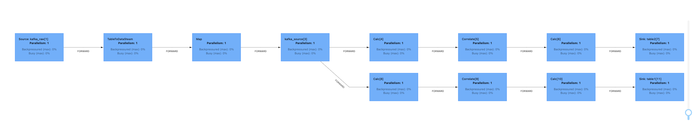

# Demo 使用

1. 修改或增加 ClickHouse Sink 表的 DDL SQL 和 DML SQL，参考 [clickhouse_dml_1.sql](src/main/resources/sql/clickhouse_dml_1.sql) 和  [clickhouse_sink_1.sql](src/main/resources/sql/clickhouse_sink_1.sql) 
2. 修改或增加 source 数据里的表名字段与 ClickHouse Sink 相关 SQL 的映射关系
3. 可能的增加 UDTF
4. ClickHouse Connector 的使用参考 [数据仓库 ClickHouse](https://cloud.tencent.com/document/product/849/53389)，本地开发时需要的 JAR 包联系 Oceanus 获取

# 示例效果

